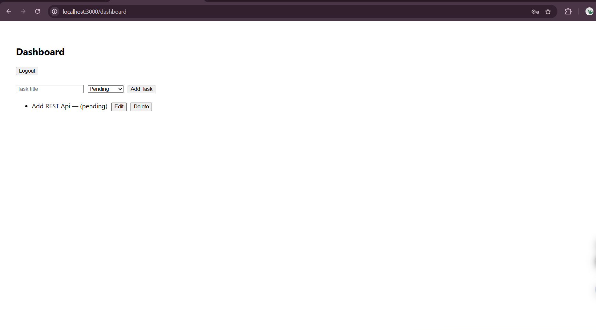

# Scalable REST API with Authentication and Role-Based Access

A full-stack application demonstrating a secure and scalable backend architecture with a basic frontend interface to interact with REST APIs.

---

# Overview

This project implements a **scalable REST API** with authentication, role-based authorization, and CRUD operations for task management.

The backend is built with Node.js and Express, while a lightweight React frontend provides a simple interface for interacting with the APIs.

The project demonstrates key backend development concepts including:

* Secure user authentication
* Role-based access control
* Modular project architecture
* Input validation and error handling
* API documentation
* Frontend integration

The goal of this project is to showcase how to design and structure a maintainable backend system suitable for real-world applications.

---

# Application Screenshot

Dashboard interface showing task creation, editing, status management, and deletion.


---

# Features

## Authentication

* User registration
* User login
* Password hashing using bcrypt
* JWT-based authentication

## Authorization

* Role-based access control (user and admin)
* Protected routes using middleware

## Task Management

Authenticated users can:

* Create tasks
* View their tasks
* Update tasks
* Delete tasks
* Update task status

Supported task statuses:

* pending
* in-progress
* completed

Each task is associated with the authenticated user.

## Frontend Interface

The React frontend allows users to:

* Register an account
* Log in to the system
* Access a protected dashboard
* Create tasks
* Update tasks and their status
* Delete tasks
* Log out

---

# Project Structure

```
scalable-api-assignment
│
├── backend
│   ├── config
│   │   └── db.js
│   │
│   ├── controllers
│   │   ├── authController.js
│   │   └── taskController.js
│   │
│   ├── middleware
│   │   ├── authMiddleware.js
│   │   ├── roleMiddleware.js
│   │   └── errorMiddleware.js
│   │
│   ├── models
│   │   ├── User.js
│   │   └── Task.js
│   │
│   ├── routes
│   │   ├── authRoutes.js
│   │   └── taskRoutes.js
│   │
│   ├── validators
│   │   └── authValidator.js
│   │
│   ├── utils
│   │   └── generateToken.js
│   │
│   ├── docs
│   │   └── swagger.js
│   │
│   └── server.js
│
├── frontend
│   ├── public
│   └── src
│       ├── pages
│       │   ├── Login.js
│       │   ├── Register.js
│       │   └── Dashboard.js
│       │
│       ├── services
│       │   └── api.js
│       │
│       └── App.js
│
├── package.json
└── README.md
```

---

# Technology Stack

## Backend

* Node.js
* Express.js
* MongoDB Atlas
* Mongoose
* JSON Web Token (JWT)
* bcrypt
* Joi validation
* Swagger UI

## Frontend

* React
* React Router
* Axios

---

# API Endpoints

## Authentication

```
POST /api/v1/auth/register
POST /api/v1/auth/login
```

## Tasks

```
GET    /api/v1/tasks
POST   /api/v1/tasks
PUT    /api/v1/tasks/:id
DELETE /api/v1/tasks/:id
```

All task routes require a JWT token.

Example request header:

```
Authorization: Bearer <token>
```

---

# Example API Response

Login Response

```
{
  "message": "Login successful",
  "token": "JWT_TOKEN",
  "user": {
    "id": "user_id",
    "name": "Rachit",
    "email": "user@test.com",
    "role": "user"
  }
}
```

---

# API Documentation

Interactive API documentation is available through Swagger.

Access the documentation at:

```
http://localhost:5000/api-docs
```

Swagger allows developers to explore and test API endpoints directly from the browser.

---

# Setup

## 1. Clone the Repository

```
git clone <repository-url>
cd scalable-api-assignment
```

---

## 2. Install Dependencies

```
npm install
```

---

## 3. Environment Configuration

Create a `.env` file inside the backend folder.

```
PORT=5000
MONGO_URI=your_mongodb_connection_string
JWT_SECRET=your_secret_key
JWT_EXPIRE=1d
```

---

## 4. Run the Application

Start both backend and frontend together:

```
npm run dev
```

Backend runs on:

```
http://localhost:5000
```

Frontend runs on:

```
http://localhost:3000
```

---

# Security Practices

The project implements several security measures:

* Password hashing using bcrypt
* JWT-based authentication
* Authorization middleware for protected routes
* Input validation using Joi
* Centralized error handling
* Protected APIs using Bearer tokens

---

# Scalability Considerations

The backend is designed with scalability in mind through:

* Modular architecture
* Separation of concerns (controllers, routes, middleware)
* Stateless authentication using JWT
* API versioning
* Input validation and error middleware

Potential future improvements include:

* Redis caching
* Docker containerization
* Microservices architecture
* Rate limiting
* Centralized logging and monitoring

---

# Author

Rachit
Computer Science Engineering Student

---

# License

This project is created for educational and internship evaluation purposes.
