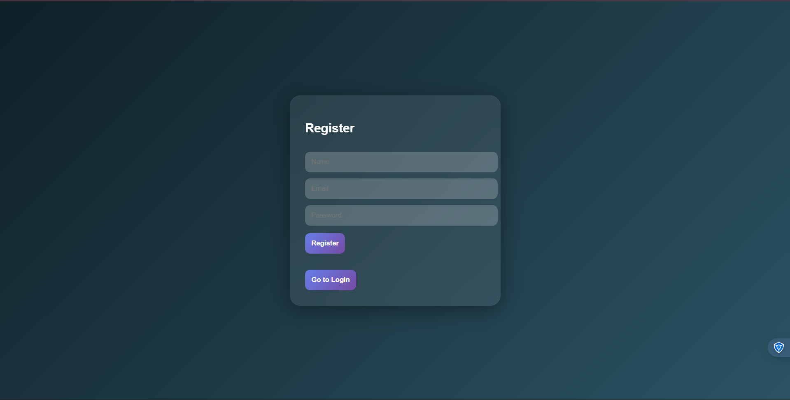
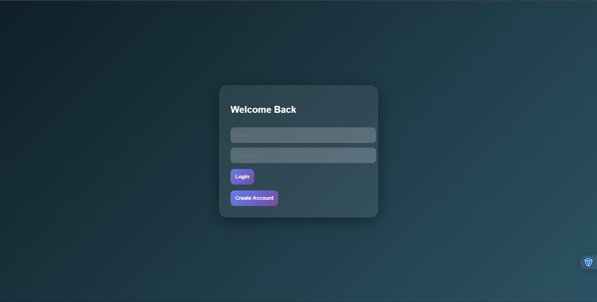
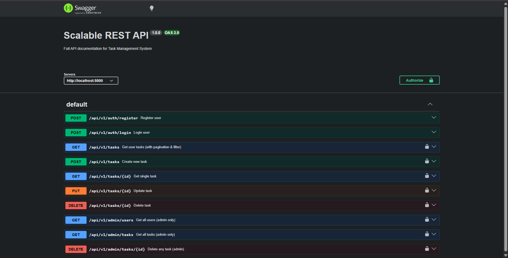

# Scalable REST API with Authentication & Role-Based Access

A full-stack application demonstrating a **secure, scalable backend architecture** with a modern frontend UI for interacting with REST APIs.

---

## Overview

This project implements a **production-ready REST API** with:

* JWT-based authentication
* Role-based authorization (User & Admin)
* Task management system (CRUD)
* Modular backend architecture
* Security best practices
* Swagger API documentation
* Modern glassmorphism UI

The goal is to showcase **backend engineering skills + real-world system design thinking**.

---

## Application Screenshots

| Register Page | Login Page |
|----------------|-------------------|
|  |  |

| Dashboard | Swagger Docs |
|------------------|-------------------|
|  |  |
---

## Features

### Authentication

* User registration & login
* Password hashing using **bcrypt**
* JWT-based authentication
* Token expiration handling

---

### Authorization

* Role-based access control:

  * `user`
  * `admin`
* Protected routes via middleware
* Admin-only endpoints

---

### Task Management

Authenticated users can:

* Create tasks
* View tasks (with pagination & filtering)
* Update tasks
* Delete tasks

Task statuses:

* `pending`
* `in-progress`
* `completed`

---

### Admin Features

* View all users
* View all tasks
* Delete any task

---

### Security

* JWT authentication
* Password hashing
* Rate limiting (API protection)
* Helmet (secure HTTP headers)
* Input validation using Joi

---

### API Features

* RESTful API design
* API versioning (`/api/v1`)
* Pagination & filtering
* Standardized response format
* Centralized error handling

---

### API Documentation

* Swagger UI integration
* Interactive API testing
* Bearer token authentication support

Access:

```
http://localhost:5000/api-docs
```

---

### Frontend (React)

* Modern **glassmorphism UI**
* Toast notifications (react-hot-toast)
* Responsive layout
* Protected dashboard
* Full CRUD integration

---

## Project Structure

```
scalable-api-assignment
│
├── backend
│   ├── config/
│   ├── controllers/
│   ├── middleware/
│   ├── models/
│   ├── routes/
│   ├── utils/
│   ├── validators/
│   ├── docs/
│   └── server.js
│
├── frontend
│   ├── src/
│   │   ├── pages/
│   │   ├── components/
│   │   ├── services/
│   │   └── App.js
│
├── assets/
│   ├── login.png
│   ├── register.png
|   ├── dashboard.png
│   └── swagger_docs.png
│
└── README.md
```

---

## Tech Stack

### Backend

* Node.js
* Express.js
* MongoDB Atlas
* Mongoose
* JWT (Authentication)
* bcrypt (Hashing)
* Joi (Validation)
* Swagger UI

---

### Frontend

* React.js
* React Router
* Axios
* React Hot Toast

---

## API Endpoints

### Authentication

```
POST /api/v1/auth/register
POST /api/v1/auth/login
```

---

### Tasks

```
GET    /api/v1/tasks
GET    /api/v1/tasks/:id
POST   /api/v1/tasks
PUT    /api/v1/tasks/:id
DELETE /api/v1/tasks/:id
```

---

### Admin

```
GET    /api/v1/admin/users
GET    /api/v1/admin/tasks
DELETE /api/v1/admin/tasks/:id
```

---

### Headers

```
Authorization: Bearer <JWT_TOKEN>
```

---

## Setup & Installation

### Clone Repository

```
git clone https://github.com/Rachit753/scalable-api-assignment.git
cd scalable-api-assignment
```

---

### Install Dependencies

```
npm run install:all
```

---

### Environment Variables

Create `.env` inside `/backend`:

```
PORT=5000
MONGO_URI=your_mongodb_connection_string
JWT_SECRET=your_secret_key
JWT_EXPIRE=1d
```

---

### Run Application

```
npm run dev
```

---

### URLs

| Service      | URL                            |
| ------------ | ------------------------------ |
| Frontend     | http://localhost:3000          |
| Backend      | http://localhost:5000          |
| Swagger Docs | http://localhost:5000/api-docs |

---

## Scalability Considerations

This project is designed with scalability in mind:

* Modular architecture (controllers, routes, middleware)
* Stateless authentication (JWT)
* API versioning
* Database abstraction with Mongoose

### Future Improvements

* Redis caching
* Docker containerization
* Microservices architecture
* Load balancing
* Centralized logging & monitoring

---

## Key Highlights

* Clean and maintainable code structure
* Real-world backend patterns
* Secure API implementation
* Full frontend-backend integration
* Production-ready architecture approach

---

## Author

**Rachit**
Computer Science Engineering Student